# Automatic Colorization of Eiffel Tower Images

## Overview

This project, developed during my third year of undergraduate studies for an Image Analysis course, focuses on the automatic colorization of images. The objective is to classify and assign colors to segmented parts of an image based on feature extraction methods. By leveraging the Lab color space, K-means clustering, SLIC superpixel segmentation, and SVM classification, the project aims to automatically colorize grayscale representations of the Eiffel Tower.

## Project Steps

### 1. Image Collection and Preprocessing

- **Image Collection**: Images of the Eiffel Tower were collected for use in the colorization process.
- **Image Resizing**: Images were resized to a lower quality to speed up processing without sacrificing essential details. The aspect ratio of the images was preserved during resizing.

**Before and After Resizing**:
Before Resizing            |  After Resizing
:-------------------------:|:-------------------------:
  |  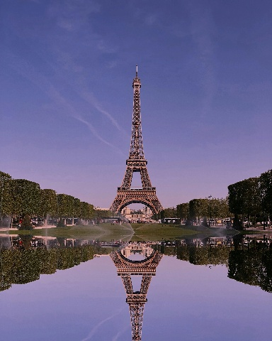

### 2. Color Space Conversion

- **RGB to Lab Conversion**: The images were converted from RGB to Lab color space:
  - **L (Lightness)** represents luminance.
  - **A (Green to Magenta)** and **B (Blue to Yellow)** represent chromaticity.
  
  By **dropping the L channel**, the dimensionality was reduced, retaining the necessary color information (AB channels) to achieve colorization while focusing only on the chromatic properties.

RGB Color Space            |  LAB Color Space
:-------------------------:|:-------------------------:
  |  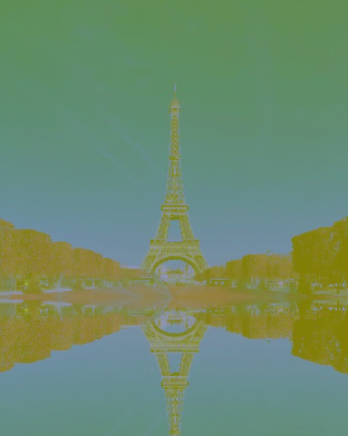

### 3. Color Palette Creation

- **K-Means Clustering**: Using the AB channels, K-means clustering was applied to group colors and create color palettes. Each palette is composed of centroid colors representing a variety of hues from the original image.

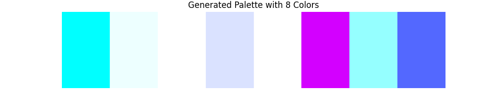

- **Information Loss in Conversion**: During the RGB-Lab-RGB transformation process, some color information is lost, which slightly impacts the quality of the color palette.

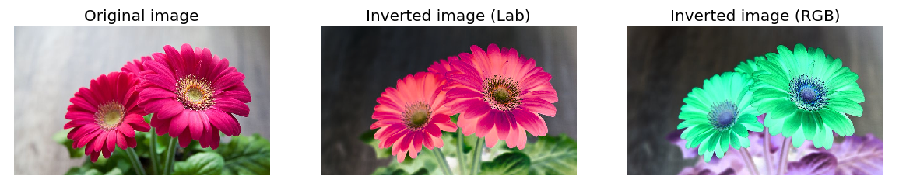

### 4. Superpixel Segmentation

- **SLIC Superpixels**: The images were divided into superpixels using the SLIC algorithm. Superpixels are clusters of adjacent pixels with similar properties.

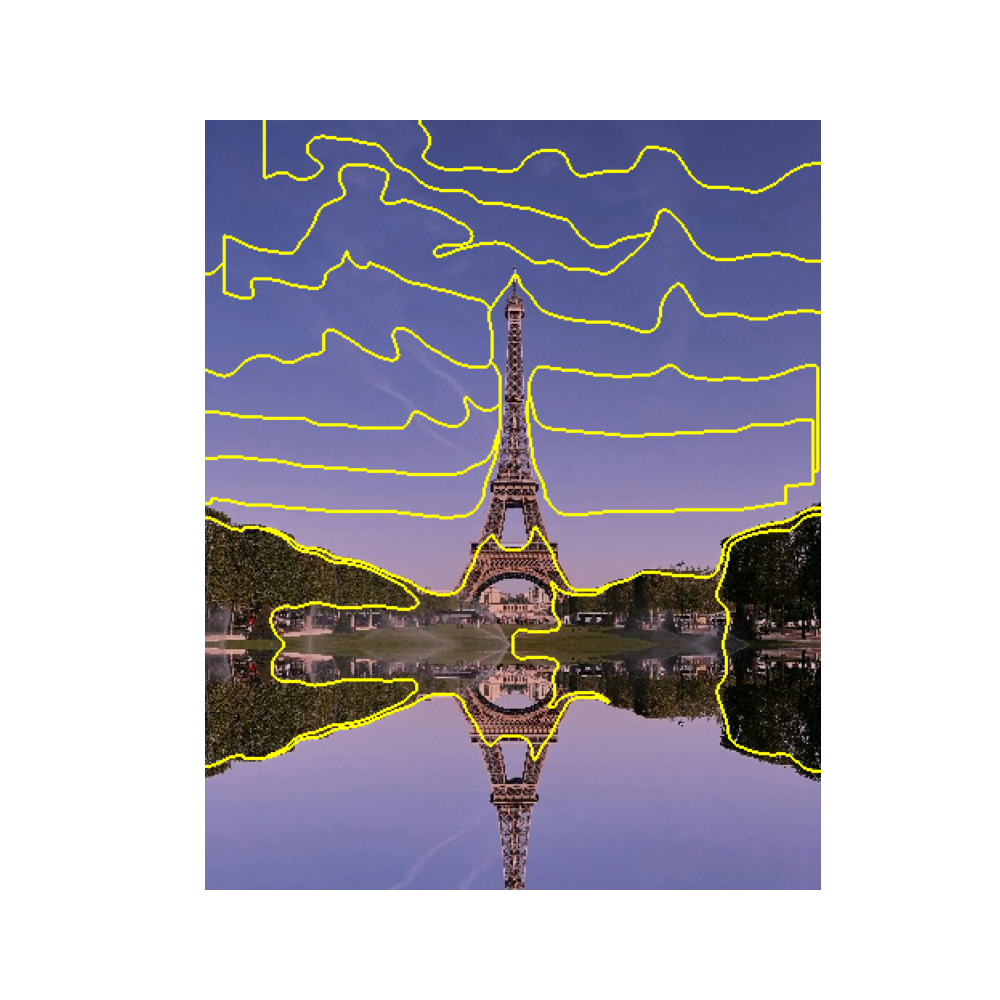

- **Color Assignment**: For each superpixel:
  - The **mean AB values** were computed.
  - The mean values were matched to the nearest color in the palette using Euclidean distance.

### 5. Feature Extraction

- **SIFT Features**: The SIFT (Scale-Invariant Feature Transform) algorithm was used to extract feature vectors from the grayscale version of each superpixel.

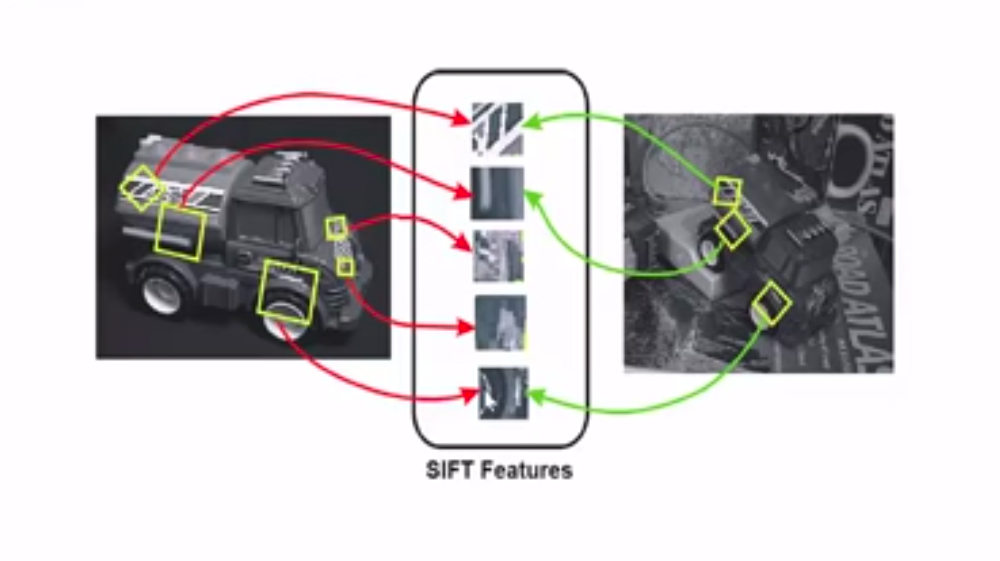

- **Gabor Features**: Gabor filters were applied to extract texture features, utilizing various orientations and scales to capture different patterns.

Gabor filters            |  Image with overlaid gabor filters
:-------------------------:|:-------------------------:
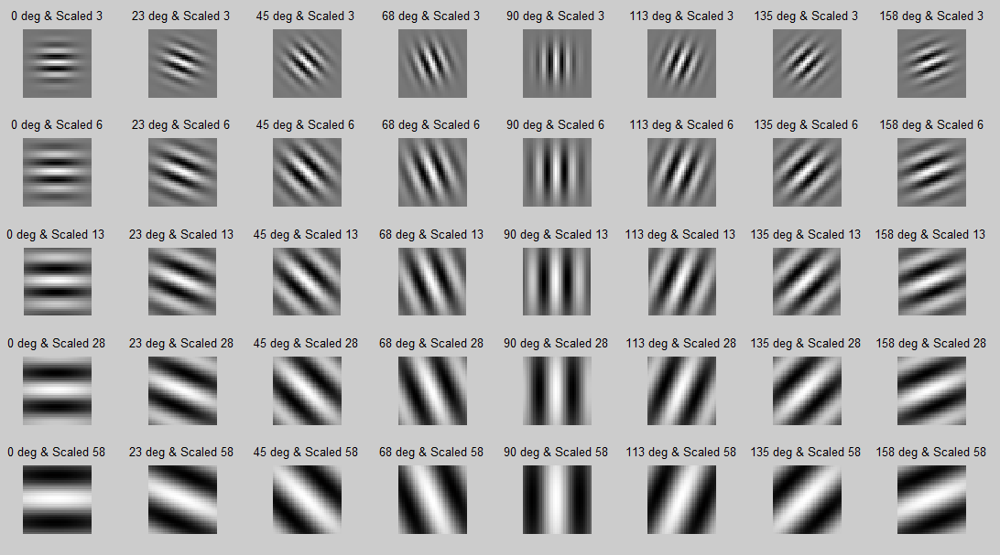  |  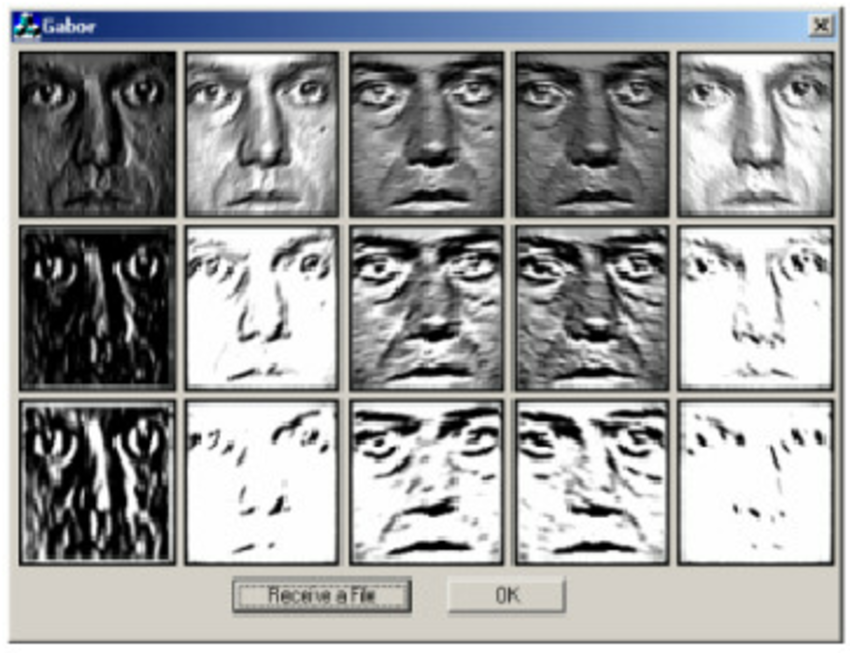

### 6. Color Classification with SVM

- **Support Vector Machine (SVM) Training**: An SVM was trained using the SIFT and Gabor features as inputs. The model learned to classify superpixels based on the color palettes. To optimize the performance, `GridSearchCV` was used to find the optimal parameters for the SVM. Then the models' performance was evaluated on a small subset of the training set and the best perfoming model was selected.

- **Testing**: The models' practical performance was tested on three example images to evaluate its visual results on the colorization task.


Image 1          |  Image 2 | Image 3
:-------------------------:|:-------------------------:|:-------------------------:
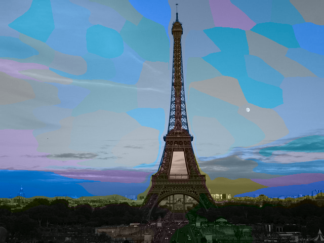  |  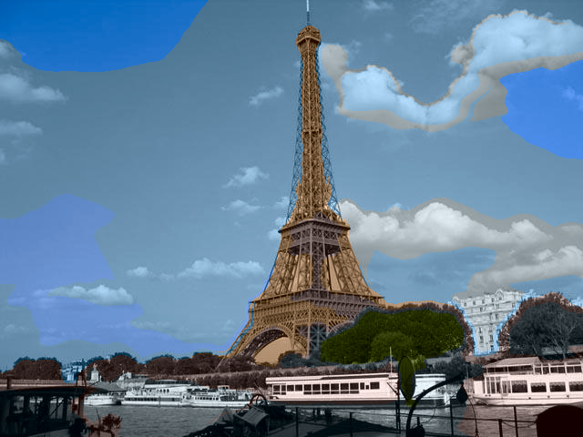 | 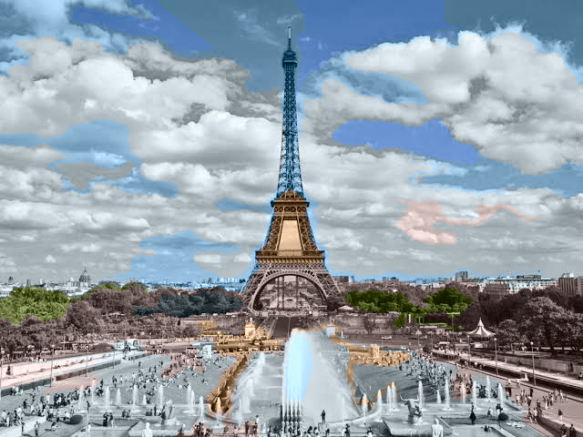

### 7. Future Work

- **Palette Size and Superpixel Number Optimization**: The project does not currently optimize the number of superpixels or the palette size. Future work will include evaluating combinations of these parameters by calculating the mean difference between the original and predicted RGB values.

## Getting Started

### Prerequisites

- Python 3.x
- Virtualenv for creating isolated Python environments

### Installation and Running

You can run the entire project using the included `Makefile`. The `Makefile` will set up a virtual environment, install dependencies, and run all necessary steps. To run the project, simply execute the following command:

```bash
make
```

**This command will**:

1. Create a virtual environment.
2. Install all required dependencies.
3. Resize the images.
4. Create color palettes.
5. Extract features and labels.
6. Train the SVM model.
7. Test the model.

**Running Independent Scripts**:

To run specific parts of the project independently, use the following commands:

```bash
make resize   # Run image resizing script
make palette  # Run palette creation script
make features # Run feature extraction script
make train    # Train the SVM model
make test     # Test the model on test images
```

**Clean Up**:
To clean up the virtual environment, run:

```bash
make clean
```
